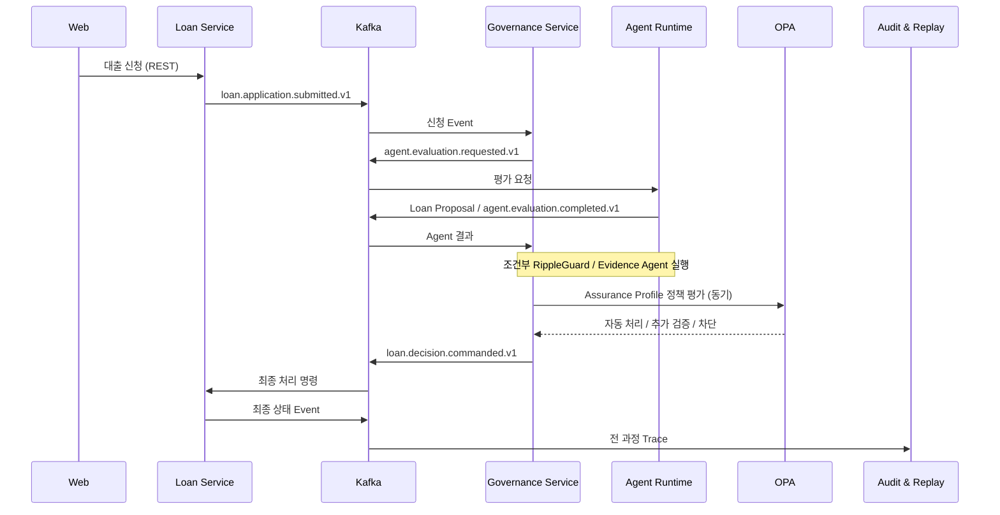

# Data Flow

사용자 명령, 즉시 조회, 정책처럼 즉시 응답이 필요한 검증은 REST 또는 동기 API를 사용한다. 서비스 간 상태 변경, 장시간 Agent 실행, 감사 기록은 Kafka Event로 결합도를 낮춘다. Kafka 전달은 중복과 지연을 전제로 멱등 처리하며, Event Schema의 원본은 `rippleguard-contracts`에 둔다.
