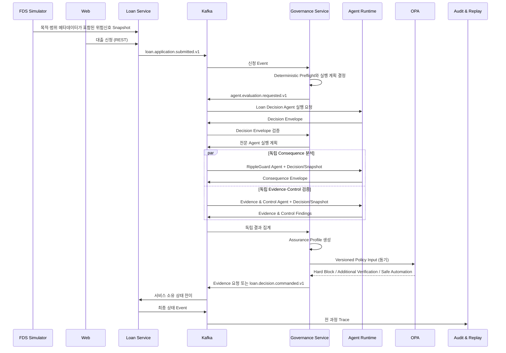

# Data Flow

Governance Service가 어떤 전문 Agent가 필요한지와 실행 순서를 결정하고, Agent Runtime은 그 계획을 실행한다. Agent Runtime이 호출 필요성을 정책적으로 확대하거나 서로의 결론을 입력으로 연결하지 않는다.

사용자 명령과 즉시 조회, OPA 정책 평가는 REST 또는 동기 API를 사용한다. 서비스 간 상태 변경, 장시간 Agent 실행, 감사 기록은 Kafka Event를 사용한다. Kafka 전달은 중복과 지연을 전제로 멱등 처리하며, 서비스별 상태 연결은 [Lifecycle Event Map](../domain/loan-case-lifecycle.md)에 정의한다. Event Schema의 원본은 `rippleguard-contracts`다.
