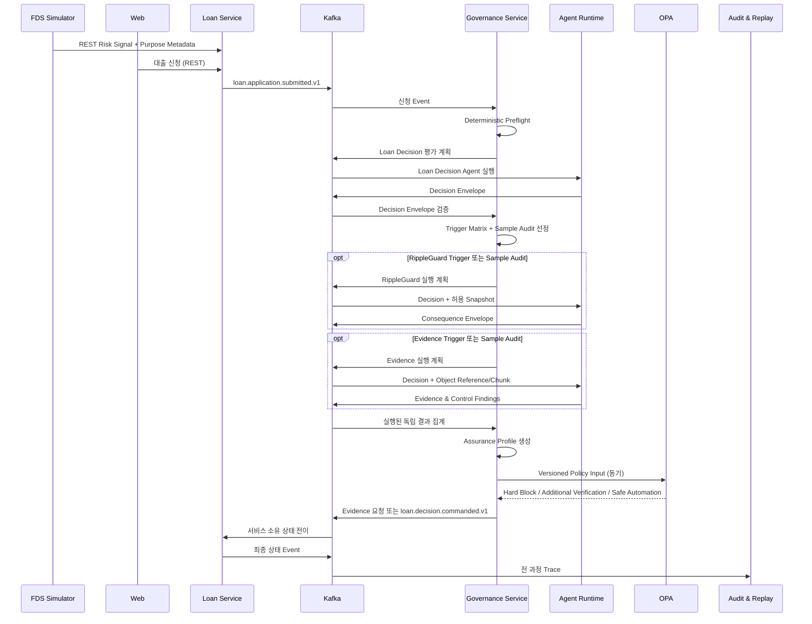

# Data Flow



Governance Service가 Deterministic Preflight와 Versioned [Trigger Matrix](agent-governance.md)를 이용해 필요한 전문 Agent와 실행 순서를 결정한다. Agent가 생략된 경우에도 Trigger 입력, Rule Version, 생략 사유를 Trace에 남긴다. Agent Runtime은 호출 필요성을 정책적으로 확대하거나 서로의 결론을 입력으로 연결하지 않는다.

사용자 명령과 즉시 조회, OPA 정책 평가는 REST 또는 동기 API를 사용한다. 서비스 간 상태 변경, 장시간 Agent 실행, 감사 기록은 Kafka Event를 사용한다. Kafka 전달은 중복과 지연을 전제로 멱등 처리하며, 서비스별 상태 연결은 [Lifecycle Event Map](../domain/loan-case-lifecycle.md)에 정의한다. Event Schema의 원본은 `rippleguard-contracts`다.

## Loan Decision Agent Flow

Phase 2 Loan Decision Agent는 Local LLM을 사용하지 않는다.

```text
Evaluation Request
-> Snapshot validation
-> Feature Transformation
-> XGBoost or LightGBM
-> SHAP
-> Decision Envelope
```

## RippleGuard and Evidence Agent Flow

Phase 3·4 specialist agents use the Local LLM Runtime through Agent Runtime only.

```text
Evaluation Request
-> Input Scope validation
-> Model Manifest validation
-> Local LLM call
-> Structured Output
-> Schema Validation
-> Deterministic Validation
-> Agent Output Event
```

Internal Chain-of-Thought is not stored in events or Audit. Full prompts and full responses are not published to Kafka. Audit receives structured results and version metadata, not raw model transcripts.
