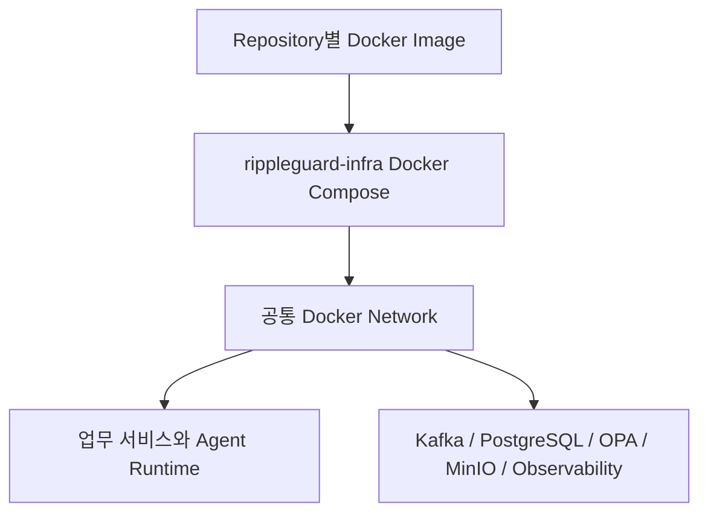

# Deployment View

MVP의 각 코드 Repository는 독립 Docker Image를 생성한다. `rippleguard-infra`의 Docker Compose가 해당 Image와 Kafka, 서비스별 PostgreSQL, OPA, MinIO, 관측 구성요소를 공통 Docker Network에서 조합한다.



통합 Baseline은 `latest`가 아니라 검증된 Image tag와 Commit SHA로 고정한다. Kubernetes와 운영 클라우드 토폴로지는 MVP 범위에 포함하지 않는다.

구성요소별 언어와 플랫폼 기준은 [Technology Stack](technology-stack.md)을 따른다.

## MVP Local Development

MVP Local Development의 Developer Baseline은 macOS Host의 Ollama와 Docker Compose 업무 서비스를 분리한다.

```text
Host:
Ollama

Docker Compose:
Loan Service
Governance Service
Audit & Replay Service
Agent Runtime
Kafka
PostgreSQL
OPA
MinIO
Observability
```

Host Ollama를 우선하는 이유는 Apple Silicon 가속, Model Cache 재사용, Agent Runtime Image 크기 분리, 모델과 서비스 배포 주기 분리다. `host.docker.internal`은 개발 연결 방식의 예시일 뿐 운영 표준으로 고정하지 않는다.

Linux 개발 환경은 Dockerized Ollama 또는 llama.cpp Server를 Portable Baseline 후보로 사용한다. `host.docker.internal`이 지원되지 않는 환경에서는 명시적인 host gateway 설정 또는 containerized model runtime을 사용해야 한다. CPU fallback은 개발 검증에는 허용할 수 있지만, Evaluation baseline에는 GPU/Metal 사용 여부, runtime provider, provider version, latency와 memory 조건을 함께 기록해야 한다.

GitHub Actions 기본 runner에서는 Local Model E2E를 필수로 실행하지 않는다. CI Baseline은 mock 또는 contract test를 우선하며, Local Model E2E는 self-hosted runner 또는 manual evidence로 기록한다.

## 후속 Reproducible Runtime

후속 Phase에서는 Dockerized Ollama 또는 llama.cpp Server Container를 Portable Baseline으로 검토한다. Portable Baseline은 Phase 8 이전에 확정되어야 하며, 이 변경은 Model Manifest, Provider Adapter, Runtime Version과 장애 Drill 기준을 함께 갱신해야 한다.
