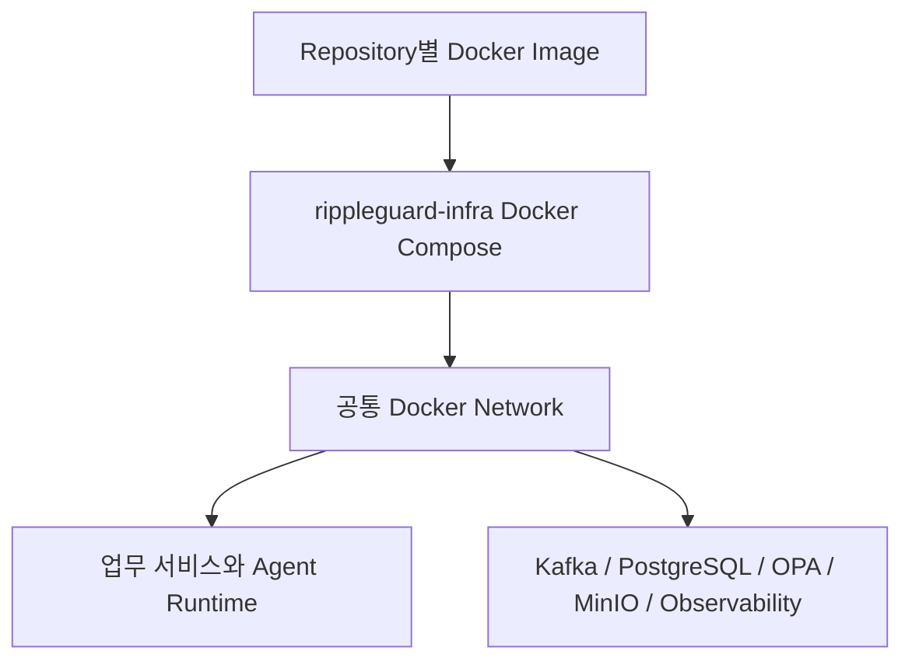

# Deployment View

MVP의 각 코드 Repository는 독립 Docker Image를 생성한다. `rippleguard-infra`의 Docker Compose가 해당 Image와 Kafka, 서비스별 PostgreSQL, OPA, MinIO, 관측 구성요소를 공통 Docker Network에서 조합한다.

통합 Baseline은 `latest`가 아니라 검증된 Image tag와 Commit SHA로 고정한다. Kubernetes와 운영 클라우드 토폴로지는 MVP 범위에 포함하지 않는다.

구성요소별 언어와 플랫폼 기준은 [Technology Stack](technology-stack.md)을 따른다.
