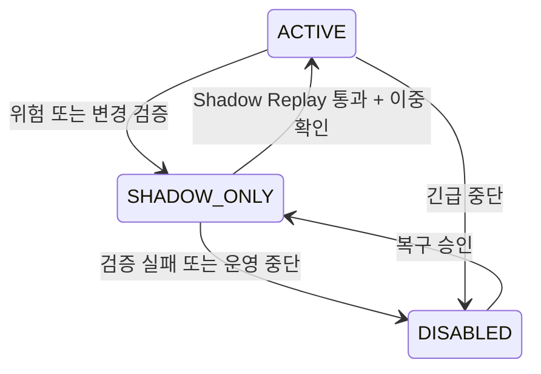

# Governance Console

## 역할과 권한

| 역할 | 허용 범위 | 금지 범위 |
| --- | --- | --- |
| AI Governance Operator | Agent 상태 변경 제안·긴급 중단, Safe Mode·Segment Isolation 운영, Replay 확인 | 감사 기록 수정, Hard Block Override, 운영 화면에서 Prompt 직접 수정 |
| AI Auditor | Trace, 정책·버전, Replay와 변경 이력 조회 | Agent 상태·정책·대출 결과 변경 |

최소 권한과 역할 분리를 적용하고 모든 운영 동작에 사용자, 시각, 대상, 이전·이후 상태, 사유를 기록한다.

## Agent 상태 전이

`DISABLED → ACTIVE` 직접 전환은 금지한다. 긴급 중단과 자동화 축소는 지정된 Operator 1인이 실행할 수 있지만, 자동화 범위를 확대하는 `SHADOW_ONLY → ACTIVE`는 Golden Case·Shadow Replay 통과와 이중 확인이 필요하다. 모든 상태 변경에는 구조화된 사유와 관련 Incident·Replay Reference가 필수다.

## 안전 통제

- Manual Safe Mode는 Agent 또는 정책 전체의 자동 결정 경로를 중단하고 승인된 수동 절차로 축소한다.
- Segment Isolation은 특정 상품, 신청자 Segment, 모델·Agent Version 또는 위험신호 Source만 격리한다.
- Console은 Run Trace, Golden Case Replay, Version Diff와 System Health를 연결해 보여준다.
- Prompt와 정책 원본은 운영 화면에서 직접 편집하지 않는다. Versioned Repository 변경, 검증, 승인, 배포 절차를 거친다.
- 안전 통제 해제는 활성화와 동일한 검증·이중 확인을 요구한다.
