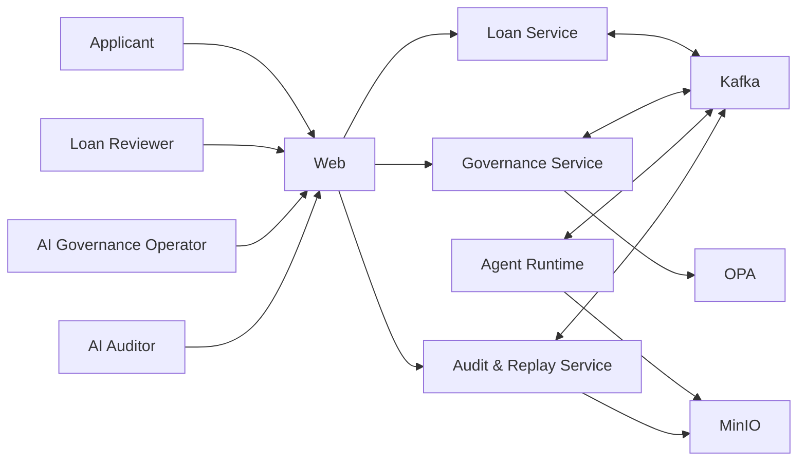

# System Context

Applicant는 대출을 신청하고 Loan Reviewer는 보완이 필요한 심사를 확인한다. AI Governance Operator는 Agent와 정책의 운영 상태를 통제하며 AI Auditor는 저장된 Trace와 Replay 결과를 검토한다.

Loan Service는 신청과 최종 대출 상태를, Governance Service는 Decision Case와 Assurance를 소유한다. Agent Runtime은 계약된 평가를 수행하고, Audit & Replay Service는 변경 불가능한 실행 기록과 재현을 제공한다. OPA는 정책 결정을, Kafka는 비동기 상태 전달을, MinIO는 문서 원본과 증거 객체 저장을 담당한다.
