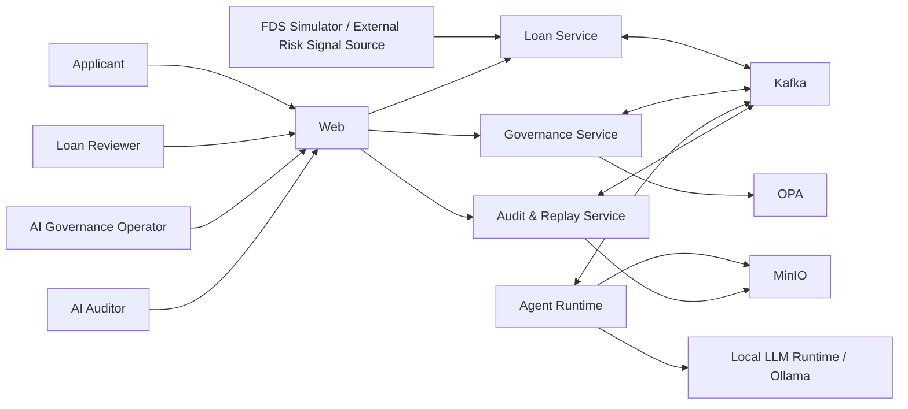

# System Context

Applicant는 대출을 신청하고 Loan Reviewer는 보완이 필요한 심사를 확인한다. AI Governance Operator는 Agent와 정책의 운영 상태를 통제하며 AI Auditor는 저장된 Trace와 Replay 결과를 검토한다.

FDS Simulator는 실제 금융기관 연동 없이 Cross-Purpose Data Reuse와 Scope Escalation을 재현할 외부 위험신호를 제공한다. 운영형 Demo의 주 경로는 `rippleguard-infra`가 관리하는 경량 Mock Server Container의 REST API이며 Loan Service가 Versioned Risk Signal Snapshot으로 저장한다. 단위·통합 Test는 고정 JSON Fixture를 사용한다. 별도 Repository는 만들지 않는다.

각 신호에는 `originalPurpose`, `subjectType`, `inferenceStatus`, `confidence`, `validUntil`, `permittedUses`, `prohibitedUses`, `sourceSystem`이 포함되어야 한다. 이 메타데이터가 없거나 유효기간이 지난 신호는 자동 판단 근거로 사용할 수 없다.

Loan Service는 신청과 최종 대출 상태를, Governance Service는 Decision Case, Assurance와 채택된 Versioned Evidence Finding Snapshot을 소유한다. Agent Runtime은 계약된 평가를 수행하고 Phase 3·4에서만 Local LLM Runtime을 호출한다. Governance Service, Loan Service, Audit & Replay Service와 Web은 Ollama를 직접 호출하지 않는다. Audit & Replay Service는 Append-only Event와 Hash Chain을 이용해 변경 여부를 탐지할 수 있는 **Tamper-Evident Audit Log**와 Replay를 제공한다. MVP는 WORM이나 블록체인을 사용하지 않으므로 기록 자체가 물리적으로 변경 불가능하다고 보장하지 않는다. OPA는 정책 결정을, Kafka는 비동기 상태 전달을, MinIO는 사용자 제출 원본과 선택적 대용량 파싱 Artifact 저장을 담당한다.
