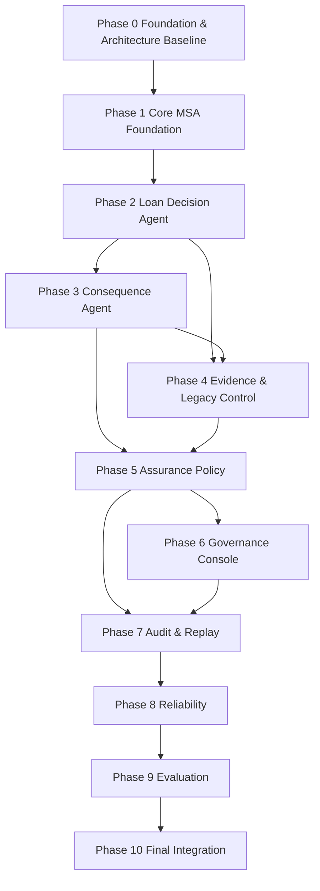

# Phase Dependency Map

| Phase | 필수 선행 결과 | 제한적 병렬 가능 범위 | 시작 금지 조건 |
| --- | --- | --- | --- |
| 1 | Phase 0 상태·계약·소유권 기준 | Infra Skeleton | 핵심 Event·DB 소유권 미정 |
| 2 | Phase 1 Versioned Snapshot·평가 경계 | 합성 데이터 준비 | 최소 수직 흐름 미검증 |
| 3 | Phase 2 Decision Envelope | FDS Case 작성 | Decision provenance 미검증 |
| 4 | Phase 2 Decision, Phase 3 독립 실행 경계 | 문서 Fixture·Control Registry | 문서 보안·Finding 계약 미정 |
| 5 | Consequence와 Evidence Findings | OPA Rule 초안 | 필수 입력·Hard Block 의미 미정 |
| 6 | Phase 5 Agent 상태·Task·정책 API, Phase 1~2 최소 Trace API, Versioned Topology Manifest 초안 | Phase 5 후반 Web 기본 화면과 Static Architecture Graph 초안 | 권한·상태 또는 최소 Timeline API 미검증 상태의 운영 변경, Manifest가 실제 Architecture Baseline과 대조 불가 |
| 7 | Phase 1~2 Audit Foundation, Phase 5 Trace Metadata, Phase 6 운영 Event, Graph Node·Link 계약 초안 | Hash Chain·Replay 설계와 Execution Graph Read Model 설계 | Correlation·Causation·Version Metadata 미정 |
| 8 | 전체 수직 Trace와 Replay | 장애 Scenario 작성 | 정상 경로 Baseline 미검증 |
| 9 | Reliability 검증 Baseline, Timeline·Graph 조회 Baseline | 평가 Script·보고서 틀 | 실행 불안정, Golden Case 미고정 또는 Graph와 Timeline 의미 불일치 |
| 10 | Phase 0~9 검증 결과 | 문서 Link·Readiness 사전 점검 | 필수 Baseline·평가 Evidence 누락 |

병렬 착수는 해당 작업의 산출물을 `VERIFIED`로 간주한다는 뜻이 아니다. 선행 Phase의 계약과 통합 결과가 고정되기 전에는 Consumer 최종 검증과 Baseline 확정을 할 수 없다.
